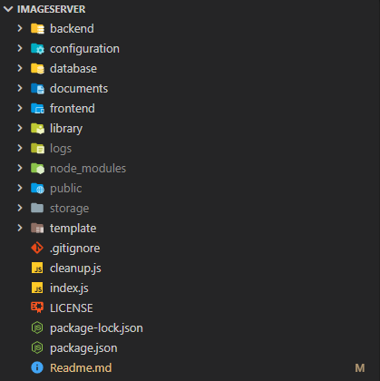

# Image Server

<!-- markdownlint-disable MD041 -->
<!-- markdownlint-disable MD033 -->
<div style="margin-bottom:150px">
    <a href="https://www.sunderland.ac.uk/">
        
    </a>
    <a href="https://www.ismt.edu.np/">
        
    </a>
</div>

           

[](https://wakatime.com/badge/user/31d076e5-7f32-41dd-b1a2-a772c1767c0c/project/43d9dc89-718c-47a3-99dc-23c4bda734fa)

## Table of Contents

- [Image Server](#image-server)
  - [Table of Contents](#table-of-contents)
  - [Students Declaration](#students-declaration)
  - [Introduction](#introduction)
  - [Requirements](#requirements)
  - [Setup](#setup)
    - [Pre-Requisites](#pre-requisites)
    - [Assumptions](#assumptions)
    - [Suggestions](#suggestions)
    - [Instructions](#instructions)
    - [Directory Structure](#directory-structure)
  - [Overwriting Configurations](#overwriting-configurations)
    - [logger](#logger)
    - [server](#server)
    - [limit](#limit)
    - [expiry](#expiry)
    - [image](#image)
    - [database](#database)
    - [mail](#mail)
    - [reCaptcha](#recaptcha)
    - [jwt](#jwt)
  - [Setup Mailtrap](#setup-mailtrap)
  - [Setup ReCaptcha](#setup-recaptcha)
  - [Development Configurations](#development-configurations)
    - [Frontend Configurations](#frontend-configurations)
    - [Backend Configurations](#backend-configurations)
    - [Development Feature](#development-feature)
  - [Restart Server](#restart-server)
  - [Resolve PORT Conflict](#resolve-port-conflict)
    - [Ubuntu](#ubuntu)
    - [Windows](#windows)
  - [Application Demonstration](#application-demonstration)
  - [Support](#support)
  - [Issues](#issues)
  - [References](#references)

## Students Declaration

|Title          |   Description                 |
|--------------:|:------------------------------|
|Programme      | Computer Systems Engineering  |
|Module Name    | Advanced CyberSecurity        |
|Module Code    | CET324                        |
|Assignment     | Two                           |
|Module Leader  | Mr. Binod Rimal               |
|Batch          | 2021-2022                     |
|Student Name   | Dibesh Raj Subedi             |
|Student ID     | 219327253                     |

## Introduction

Image server is a web application created in completion of **Advanced CyberSecurity** module and part of second Assignment of the module. This web application is developed to provide a registration system and demonstrate a good security approach to avoid the security issues.

## Requirements

Produce a computer programme (in your choice of language) for a prototype system which illustrates appropriate design of security systems and the application of programming principles to cybersecurity applications.

Participating in online communities require users to register on the platform to create a user account. The registration process should be secure to protect user information. One of the steps often involves using captcha to validate that the request for registration is made by a human user rather a machine, e.g., bot.

You are required to produce a computer programme containing the following
features as minimum:

- A user interface to prompt a user to create an account by providing username and password.
- Algorithmically determine the strength of the chosen password by the user.
- Provides suitable feedback to user about the password strength. You should research password strength criteria and use your finding to help you with this task.
- Implement a captcha function to determine that registration request is made by a human user. For this task, you should research different types of captcha and implement one type.

Your prototype and prototype design should illustrate and embed good secure system design and apply appropriate cybersecurity principles and techniques showing your understanding and knowledge of secure system design. Where appropriate, you should make use of robust policies and procedures for password – for example (but not limited to) frequency of change, strength of password, preventing repetition of passwords, use of encryption etc.

## Setup

Setting up project is relatively easy if you have `Node.js` installed in your pc.

1. Clone the repo or download the repo from [https://github.com/itSubeDibesh/ImageServer](https://github.com/itSubeDibesh/ImageServer)
2. Open terminal pointing to cloned directory and follow the [Instructions](#instructions) section.

### Pre-Requisites

1. Internet connection to download required packages.
1. [**Node.js version 12.x.x or higher. (v14+ recommended)**](https://nodejs.org/)
1. [**VisualStudio Code (VsCode) latest version.**](https://code.visualstudio.com/)

### Assumptions

I assume that the user has installed Node.js version 12.x.x or higher. (v14+ recommended) and the user has internet connection to download required packages. The user knows how to install  **Node.js** version 12.x.x or higher if not installed. The user also have basic knowledge of how to use **command line** and **VsCode**.

### Suggestions

Please use VisualStudio Code(VsCode) to have a better experience exploring files and all the   documents of the project. Open the "Readme.md" file in VsCode and use "ctrl+shift+v" command to have a better experience.

### Instructions

  To run the project open your command line interface (CLI) and navigate to the current directory and observe whether the `node_modules` folder is created. If not then run the following command:

```bash
  npm run setup
```

  This will install all the required _packages_. Now simply run another command to start the project:

``` bash
  npm run prod
```

You would see your browser opening URL `http://localhost:8080`. If it does not check the terminal [CLI] which would show logs as shown in below.

```bash
> image_server@1.0.0 open:prod
> open-cli http://localhost:8080

 FileLogger: 📂 Directory created - file://E:/College/Advanced Cyber Security/ImageServer/logs
 FileLogger: 📂 Directory created - file://E:/College/Advanced Cyber Security/ImageServer/logs/all
 FileLogger: 📄 File created - file://E:/College/Advanced Cyber Security/ImageServer/logs/all/all_01_20220703.log
 FileLogger: 🔧 Log file 'Server' setup complete.
 FileLogger: 📂 Directory created - file://E:/College/Advanced Cyber Security/ImageServer/logs/response
 FileLogger: 📄 File created - file://E:/College/Advanced Cyber Security/ImageServer/logs/response/response_01_20220703.log
 FileLogger: 🔧 Log file 'Response' setup complete.
 FileLogger: 📂 Directory created - file://E:/College/Advanced Cyber Security/ImageServer/logs/request
 FileLogger: 📄 File created - file://E:/College/Advanced Cyber Security/ImageServer/logs/request/request_01_20220703.log
 FileLogger: 🔧 Log file 'Request' setup complete.
 FileLogger: 📂 Directory created - file://E:/College/Advanced Cyber Security/ImageServer/logs/database
 FileLogger: 📄 File created - file://E:/College/Advanced Cyber Security/ImageServer/logs/database/database_01_20220703.log
 FileLogger: 🔧 Log file 'SqlLite' setup complete.
 FileLogger: 📂 Directory created - file://E:/College/Advanced Cyber Security/ImageServer/logs/query
 FileLogger: 📄 File created - file://E:/College/Advanced Cyber Security/ImageServer/logs/query/query_01_20220703.log
 FileLogger: 🔧 Log file 'SqlQueries' setup complete.
 SqlLite: 📁 Directory Created: E:\College\Advanced Cyber Security\ImageServer\database\SQLite
 FileLogger: 🔧 Log file 'Server' setup complete.
 Server: 👂 Listening on PORT 8080, URL:http://localhost:8080
 SqlLite: 🌎 Database Connected : [ImageServer] at database/SQLite/ImageServer.db
Index->Database: Administrator Not Found.
Index->Database: Creating New Administrator.
Index: Administrator Created: "true".
```

Open your browser and open `http://localhost:8080` URl and you are good to go.

### Directory Structure



1. [backend](./backend/) directory -> All the web/api controllers.
1. [configuration](./configuration/) directory -> All the Configurations.
1. [database](./database/) directory -> All the Scripts and Database files.
1. [documents](./documents/) directory -> All necessary images and documents.
1. [frontend](./frontend/) directory -> Vue Js Codes fro frontend.
1. [library](./library/) directory -> All custom written Codes
1. [logs](./logs/) directory -> All the logs generated by server.
1. [node_modules](./node_modules/) -> All the packages and dependencies.
1. [public](./public/) -> Production Code generated by vue js.
1. [storage](./storage/) -> Image storage directory generated by server.
1. [template](./template/) -> Html template for email.

`index.js` file is the initial file that server requires whereas `cleanup.js` file is used to remove create a fresh setup of project wiping all information in database as well as images stored in `storage` directory.

⚠️ Warning : Don't Run `npm run clean` or `npm run setup` unless you want a fresh setup.

## Overwriting Configurations

⚠️ Warning: Don't Change `PORT` from configuration, which would create configuration chaos while running up server.

Open [`configuration\server.json`](./configuration/server.json) and you would be prompted with following json object.

```json
{
    "logger": {
        "enableLogger": true,
        "maxLogSize": 5,
        "logInConsole": false
    },
    "server": {
        "PORT": 8080,
        "isHttp": true,
        "preventions": {
            "sqLInjection": true,
            "enableAccessControl": true,
            "enableReCaptcha": true,
            "logoutSessionHijack": true,
            "preventCsp": false,
            "limitRequest": {
                "state": false,
                "limit": {
                    "request": 2e2,
                    "periodInMs": 3e4
                }
            }
        },
        "limit": {
            "register": {
                "requests": 3,
                "minutes": 10
            },
            "login": {
                "requests": 5,
                "minutes": 10
            },
            "image": {
                "requests": 3,
                "minutes": 10
            }
        },
        "expiry": {
            "password": {
                "renewalInMonths": 3,
                "resetExpireInMinute": 10
            }
        }
    },
    "image": {
        "extensions": [
            "jpg",
            "jpeg",
            "png",
            "gif",
            "bmp",
            "svg",
            "webp",
            "ico",
            "ttif",
            "pdf"
        ],
        "maxUploads": 10,
        "maxFileSize": 10485760,
        "storagePath": "storage/",
        "displayPath": "uploads/"
    },
    "database": {
        "scriptName": "ImageServer"
    },
    "mail": {
        "appName": "ImageServer",
        "from": "dsubedi@ismt.edu.np",
        "priority": "high",
        "port": 2525,
        "secure": false,
        "host": "smtp.mailtrap.io",
        "auth": {
            "user": "e6290a30fab054",
            "pass": "a5328582691495"
        }
    },
    "reCaptcha": {
        "siteKey": "6Ldgc0cgAAAAAHjqNfj5q4qWUruiHOnlF_3iF37k",
        "secretKey": "6Ldgc0cgAAAAAIOayrU40OKE_GDJdzdKJjSJUtKV",
        "endPoints": [
            "/api/auth/register",
            "/api/auth/verification",
            "/api/auth/login",
            "/api/auth/forgot",
            "/api/auth/reset",
            "/api/image/upload"
        ]
    },
    "jwt": {
        "secret": "jwtSecret@Image _Sever.2022",
        "expiry": "2h",
        "appliedEndPoints": [
            "/api/auth/logout",
            "/api/auth/login_check",
            "/api/image",
            "/api/user"
        ]
    }
}

```

This file stores all the configurations which helps to manage server. Let's have a look of individual section from the configuration.

### logger

The logger section has following configurations

```json
"logger": {
        "enableLogger": true,
        "maxLogSize": 5,
        "logInConsole": false
    }
```

`enableLogger` flag helps to enable/disable logger, whereas `manLogSize` set the maximum size of log file in `mb` it is default to `5mb` meaning when file size exceeds `5mb` it creates a new log file. `logInConsole` flag helps to enable/disable logging in console.

### server

server section has following configurations

```json
"server": {
        "PORT": 8080,
        "isHttp": true,
        "preventions": {
            "sqLInjection": true,
            "enableAccessControl": true,
            "enableReCaptcha": true,
            "logoutSessionHijack": true,
            "preventCsp": false,
            "limitRequest": {
                "state": false,
                "limit": {
                    "request": 2e2,
                    "periodInMs": 3e4
                }
            }
        },
        "limit": {
            "register": {
                "requests": 3,
                "minutes": 10
            },
            "login": {
                "requests": 5,
                "minutes": 10
            },
            "image": {
                "requests": 3,
                "minutes": 10
            }
        },
        "expiry": {
            "password": {
                "renewalInMonths": 3,
                "resetExpireInMinute": 10
            }
        }
    }
```

`PORT` is default to 8080 and don't change it, if you have port conflict the follow [Resolve Port Conflict](#resolve-port-conflict) section. Don't change `isHttp` flag as well because `https` is not implemented yet. Other than these two config you can easily change any other configurations.

There ares preventions configurations where `sqLInjection` flag is used to determine whether to prevent from **SQL Injection** or not, similarly `enableAccessControl` determines access control of application. `enableReCaptcha` flag helps to prevent from frontend brute force attack similarly `logoutSessionHijack` flag keeps track of recent logout tokens and prevents from logout hijacking. `preventCsp` flag ensures **Content Security Policies** in headers and helps to prevent them, it is defaulted to _false_ because enabling it would not allow captcha to inject `js` on dom. Similarly `limitRequest` determines number of requests to be allowed per window for specific time period. currently it it's state is `false` because it would limit request of overall application, better to keep it disabled.

### limit

limit section has following configurations

```json
"limit": {
            "register": {
                "requests": 3,
                "minutes": 10
            },
            "login": {
                "requests": 5,
                "minutes": 10
            },
            "image": {
                "requests": 3,
                "minutes": 10
            }
        }
```

Limit section limits the max request per window until the request limit exceeds and prevents request after that till the set time is over.

For example when user hits register continuously of 3 times s/he would be able to create a new account but a 4th request within 10 would blocks them to create account for 10 minutes.  

As shown in configuration `register` allows 3 request in 10 minutes, `login` allows 5 request in 10 minutes and `image` allows 3 request in 10 minutes.

📓 Note: User is allowed to upload 10 images per request with max size of 10Mb per image, meaning a user can upload 30 images within 10 minutes only as per the configuration of [limit](#limit) and [image](#image).

### expiry

expiry section has following configurations

```json
"expiry": {
            "password": {
                "renewalInMonths": 3,
                "resetExpireInMinute": 10
            }
        }
```

The expiry section forces user to rest-password every 3 months based on `renewalInMonths` configuration whereas `resetExpireInMinute` determines to expire the reset link on email within 10 minutes.

### image

image section has following configurations

```json
"image": {
        "extensions": [
            "jpg",
            "jpeg",
            "png",
            "gif",
            "bmp",
            "svg",
            "webp",
            "ico",
            "ttif",
            "pdf"
        ],
        "maxUploads": 10,
        "maxFileSize": 10485760,
        "storagePath": "storage/",
        "displayPath": "uploads/"
    }
```

`extensions` array stores the list of extensions allowed to store in server storage directory, whereas `maxUploads` determines number of uploads per request and `maxFileSize` determines the max size of file in bytes that can be stored. `storagePath` determines where to store images from request and `displayPath` returns the path that is displayed as response from where the images would be fetched.

### database

database section holds following configuration

```json
"database": {
        "scriptName": "ImageServer"
    }
```

`scriptName` in configuration determines the file name to search under [`database/Script/`](./database/Script/) directory to create a database based on that under [`database/SQLite/`](./database/SQLite/) directory along with the name that web server should look for while invoking database.

### mail

mail section holds following configurations

```json
"mail": {
        "appName": "ImageServer",
        "from": "dsubedi@ismt.edu.np",
        "priority": "high",
        "port": 2525,
        "secure": false,
        "host": "smtp.mailtrap.io",
        "auth": {
            "user": "e6290a30fab054",
            "pass": "a5328582691495"
        }
    }
```

`appName` in mail config determines the app sending email whereas `from` reveals the sender of email, `priority` determines the email priority, `port` determined port used to send email which is provided my mail client.  `secure` flag is made for https mail and `host` is used determine which host is sending email. `user` and `pass` are the configuration provided by mail client to send email.

📓 Note: The mail configuration is designed for [`mailtrap`](https://mailtrap.io) as temporary feature so you wont be able to receive the emails on defined mail address. Follow [Setup Mailtrap](#setup-mailtrap) to configure your own mailtrap for testing.

### reCaptcha

reCaptcha section holds following configuration

```json
"reCaptcha": {
        "siteKey": "6Ldgc0cgAAAAAHjqNfj5q4qWUruiHOnlF_3iF37k",
        "secretKey": "6Ldgc0cgAAAAAIOayrU40OKE_GDJdzdKJjSJUtKV",
        "endPoints": [
            "/api/auth/register",
            "/api/auth/verification",
            "/api/auth/login",
            "/api/auth/forgot",
            "/api/auth/reset",
            "/api/image/upload"
        ]
    }
```

`siteKey` in reCaptcha is used by frontend where as `secretKey` is used by backend to verify the captcha request. `endPoints` represents list of endPoints that gets verified for captcha. See [Setup ReCaptcha](#setup-recaptcha) section to set a reCaptcha.

### jwt

jwt section holds following configuration

```json
"jwt": {
        "secret": "jwtSecret@Image _Sever.2022",
        "expiry": "2h",
        "appliedEndPoints": [
            "/api/auth/logout",
            "/api/auth/login_check",
            "/api/image",
            "/api/user"
        ]
    }
```

`secret` in jwt config defines the secret key that will help to verify the token and `expiry` determines the expiry to token which is default to 2 hours, `appliedEndPoints` gets verified for jwt token when request is made.

📓 Note: Make your you have a strong `secret` in jwt configuration.

## Setup Mailtrap

Register to [mailtrap.io](https://mailtrap.io) and Navigate to [https://mailtrap.io/inboxes](https://mailtrap.io/inboxes). Click **Add Inbox** button Give Inbox Name and Click on **Save** Button. After you will see your inbox name in **"My Inboxes"** List, Click your inbox name and you would be prompted to SMTP Settings section where you would see `Integrations` change it to `Node.Js - Nodemailer` which should show something like.

```javascript
var transport = nodemailer.createTransport({
  host: "smtp.mailtrap.io",
  port: 2525,
  auth: {
    user: "aa81dfb7e7f19e",
    pass: "192f2cc77c47d8"
  }
});
```

Open `server.json` from [configuration/server.json](configuration/server.json) and under `mail` section change `user` and `pass` from mailtrap config. Also change `from` if you want to in `configuration/server.json`. Thats it and don't forget restart the server. Checkout [Restart Server](#restart-server) if you want to know more.

## Setup ReCaptcha

Navigate to [https://www.google.com/recaptcha](https://www.google.com/recaptcha) and click **v3 Admin Console** which would redirect to admin console. Click on **+**
icon and form appears, give a label and click reCaptcha v2 and select `"I'm not a robot" tickbox` add `localhost` and `127.0.0.1`. Accept the Accept the reCAPTCHA Terms of Service and click **Submit**  which would give `siteKey` and `secretKey`. Open `server.json` from [configuration/server.json](configuration/server.json) and under `reCaptcha` section copy the **SITE KEY** to `siteKey` and **SECRET KEY** to `secretKey`. Open [/frontend/src/store/index.js](/frontend/src/store/index.js) and copy **SITE KEY** to `siteKey` restart the server and that's it. Checkout [Restart Server](#restart-server) if you want to know more.

## Development Configurations

While you are running server in development you need to server tow endpoints i.e for frontend and backend. In addition you would have `http://localhost:8080/docs` endpoint where **SWAGGER** is configured for testing API endpoints. This endpoint is only accessible on development mode.

### Frontend Configurations

To server frontend on development mode run following command on separate terminal.

```bash
npm run dev:frontend
```

This should open your browser with url `http://locahgost:8079` where your UI is served.

📓 Note: Make sure your development backend server is also running to make API calls

### Backend Configurations

To server backend on development mode run following command on separate terminal.

```bash
npm run dev:backend
```

This should open your browser with url `http://localhost:8080/docs` where you can test API endpoints.

📓 Note: The `public` directory on root will be deleted wile serving backend on development mode and storage and logs directory will be deleted along with wiping the database.

To avoid db and file wipe up open `index.js` on root directory and comment line 19 and 21 which has following codes.

```js
if (process.env.WORK_ENV.includes('development')) {
    clear();
    log(`Index: Working on Development Mode.`);
    log(`Index->Library: Library imported "${Object.keys(Library).toString().replace(/,/g, ", ")}" classes.`)
    // Deleting Directories On Each Start
    const Directories =
        [
            "./database/SQLite", // <--Comment this Line
            "./logs",
            "./storage" // <--Comment this Line
        ];
    Directories.forEach(directory => {
        if (Library.File.FileSystem.dir_exists(directory)) {
            log(`Index->Library->File: Deleting "${directory}" directory.`);
            Library.File.FileSystem.delete_dir(directory, true, true);
        }
    });
}

```

### Development Feature

While you are serving project you need two terminals 1 for frontend and 1 for backend, To reduce this problem anew command is introduced which runs the both frontend and backend concurrently.

```bash
npm run dev
```

The following command will run both frontend and backend which will open `http://localhost:8080/docs` and `http://locahgost:8079` url in your browser.

## Restart Server

Restarting server in production mode is easy you can run.

```bash
npm run prod:backend
```

to run backend without recompiling frontend or you can.

```bash
npm run prod
```

which recompile the frontend and then runs the backend

## Resolve PORT Conflict

When you see following message in console it means a PORT conflict has arise.

```bash
node:events:371
      throw er; // Unhandled 'error' event
      ^

Error: listen EADDRINUSE: address already in use :::8080
    at Server.setupListenHandle [as _listen2] (node:net:1319:16)
    at listenInCluster (node:net:1367:12)
    at Server.listen (node:net:1454:7)
    at Function.listen (E:\College\Advanced Cyber Security\ImageServer\node_modules\express\lib\application.js:635:24)
    at Server.#listenHttp (E:\College\Advanced Cyber Security\ImageServer\library\server\lib.server.express.js:418:14)
    at Server.setupHTTP (E:\College\Advanced Cyber Security\ImageServer\library\server\lib.server.express.js:521:25)
    at Server.setUpServer (E:\College\Advanced Cyber Security\ImageServer\library\server\lib.server.express.js:535:31)
    at Object.<anonymous> (E:\College\Advanced Cyber Security\ImageServer\index.js:85:6)
    at Module._compile (node:internal/modules/cjs/loader:1101:14)
    at Object.Module._extensions..js (node:internal/modules/cjs/loader:1153:10)
Emitted 'error' event on Server instance at:
    at emitErrorNT (node:net:1346:8)
    at processTicksAndRejections (node:internal/process/task_queues:83:21) {
  code: 'EADDRINUSE',
  errno: -4091,
  syscall: 'listen',
  address: '::',
  port: 8080
}
```

To Fix this issue we have different solution as per the operating system.

### Ubuntu

Find PID using following command

```bash
lsof -i TCP:8080 | grep LISTEN
```

It would result in something like

```bash
node    2464 user   21u  IPv6 4392639      0t0  TCP *:http-alt
```

The Second colum after node is PID, kill the PID using following command

```bash
kill -9 2464
```

### Windows

Find the PID using following command

```bash
netstat -ano | findstr :8080
```

WHich would return something like

```bash
 TCP    0.0.0.0:8080           0.0.0.0:0              LISTENING       24552
 TCP    [::]:8080              [::]:0                 LISTENING       24552
```

Kill the PID at last after LISTENING using following command

```bash
taskkill /PID 24552 /F
```

## Application Demonstration

You can visit [https://youtu.be/ngnZQGugpVQ](https://youtu.be/ngnZQGugpVQ) to see the application demonstration.

## Support

If you have any issues please contact me at:

Email : [dibeshrsubedi@gmail.com](dibeshrsubedi@gmail.com)
LinkedIn : [https://www.linkedin.com/in/itsubedibesh](https://www.linkedin.com/in/itsubedibesh)

## Issues

Checkout [https://github.com/itSubeDibesh/ImageServer/issues](https://github.com/itSubeDibesh/ImageServer/issues) for any issues or to fill an issue.

## References

1. [OWASP - SQL Injection](https://www.owasp.org/index.php/SQL_Injection)
2. [Synk - SQL Injection Cheat Sheet](https://snyk.io/blog/sql-injection-cheat-sheet/)
3. [Murarinayak - Resolve PORT on Use]( https://www.murarinayak.com/blog/technology/how-to-resolve-eaddrinuse-address-already-in-use-error/)
